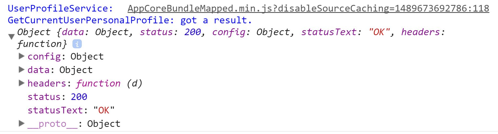
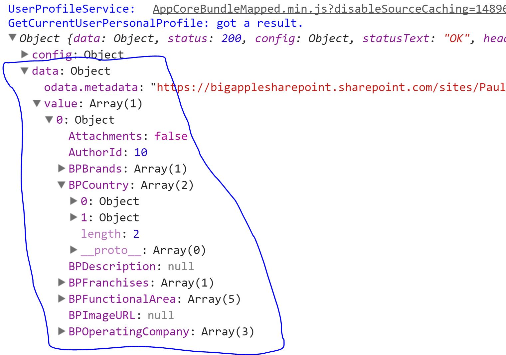

# Complex Types Using Interfaces

## What's Covered
We're going to start off this chapter by introducing TypeScript _interfaces_. This chapter examines interfaces in the context of JavaScript "data" objects and their fields/properties. As many of you know, interfaces play an over-sized role in many common design patterns (think SOLID[^1]). We will talk about interfaces in that context in Chapter 10.  

TypeScript provides other more advanced typing support that you've likely seen in C# and Java. This chapter covers some of them, including[^1]:

<div style="float:right; margin-left: 15px; border: 1px solid; width:25%; font-size: 10px">
<b><i>A Note About Generics</i></b><br/>
Generics offer a very powerful data typing capability. They look and act a lot like generics in C# and are a very effective tool helping you adhere to the DRY principle. 
<br/>
The book covers generics in chapter 11.
</div>
 
- Enumerations: Attach a human-friendly label to a number
- Unions: A variable can be a "number" or "string" or "MyBrandShinyNewObject" but not anything else.
- Custom types: Think classes but without a constructor. (If you don't know about classes, don't worry, you'll learn a it about them in chapter 10).

## Interfaces as Data Describers

Declare a TypeScript interface like this:

```TypeScript
interface myInterface {

}
```
That code defines a new interface called "myInterface". It's an empty interface, but valid[^2]. 

Variables can now declare their type as being that interface:

```TypeScript
const myVariable: myInterface;
```

Although there are some use cases for empty interfaces, you'll normally use them this way to describe complex objects. Let's consider a business scenario and implement a supporting data structure in plain JavaScript. 

Your client owns a book store and you're developing a simple app that lets your client's customers view a listing of all available books. In JavaScript object terms, a "book" has these properties:

- Author
- Title
- Genre (e.g. biography, history, sci-fi)
- Short Description
- Total Pages
- Condition (e.g. New, Great, OK, Not Great)

In pure JavaScript, we might model a book this way:

```JavaScript
var bookModel = {
    Author,
    Title,
    Genre,
    ShortDescription,
    TotalPages,
    Condition
}
```

That's simple enough. We have an object called "bookModel." The developer's intent is pretty clear, although there's actually plenty of room for improvement. If you want to re-use `bookModel` in pure JavaScript, you could clone it[^3]:

```JavaSCript
var aBookInstance = (JSON.parse(JSON.stringify(bookModel)));
```

In TypeScript, we can user interfaces to define a better shape and even self-document the model. Here is one way to do it:

```TypeScript
interface BookModel {
    Author: string;
    Title: string;
    Genre: string;
    ShortDescription: string;
    TotalPages: number;
    Condition: string;
}
```

When we want an actual book instance, we define it like this in TypeScript:

```TypeScript
let aBookInstance: BookModel;
```

This interface shows three immediate advantages TypeScript provides over JavaScript:

1. The developer's intent is much clearer. You can tell that TotalPages is meant to hold numeric values while the rest are meant to hold strings[^obvious].
2. Spot-on intellisense.
3. _It's really a model_. It's not a JavaScript variable masquerading as model. In fact, when you compile a TypeScript interface, it produces no JavaScript at all. Only the compiler knows about the interface. There is no run-time artifact.

Let's assume you agree that TypeScript conveys the the dev's intent more clearly than the pure JS example[^5]. Here's a short 40 second video showing VS Code intellisense at work:

<iframe width="840" height="473" src="https://www.youtube.com/embed/o_wxodLGT34" frameborder="0" allowfullscreen align="middle"></iframe>

**video: chapter 5, #1: Interfaces using the book approach. This video may already exist. It does: https://www.youtube.com/embed/o_wxodLGT34

Here are some key takeaways from the video: 

1. Once you define an interface, it becomes another candidate data type. Use it the same way as the built-in data types, such as string, boolean, etc.
2. Once you define a variable with an interface data type, you must usually include all of the interface fields. NOTE: As you'll soon see, it's possible to define optional interface components as well.
3. It's not enough to add all of the interface fields to the "aBook" variable. You must also add them with the correct type. In the video, I tried to assign a string value to "TotalPages" field but the IDE told me that was not allowed.

### Refactoring with Interfaces

Interfaces give us even more meaningful information and it's particularly useful when we refactor our code.

Let's imagine that we need to change our book model. When we started, we didn't realize that many books have multiple authors. As a result, we need to refactor the model and make Author an array of strings, not just a scalar / single string. 

In pure JS, we don't need to do anything special. We just start writing code like this:

```JavaSCript
var bookModel = {
    Author, // NOTE! On [such and such a date], this was converted to an array
    Title,
    Genre,
    ShortDescription,
    TotalPages,
    Condition
}

var aBookInstance = JSON.parse(JSON.stringify(bookModel));
//aBookInstance.Author = "Paul Galvin";
aBookInstance.Author = ["Paul Galvin"];

```

It's a very simple change to make, but it's quite difficult to find all the places where you need to make the change. You mostly have to do a global search in your IDE to find instances of "Author" and refactor where you find them.

Contrast this with TypeScript:

<iframe width="728" height="408" src="https://www.youtube.com/embed/fNtcCTeMAhQ" frameborder="0" allowfullscreen></iframe>

**video: chapter 5, complex types: already exists, https://www.youtube.com/embed/fNtcCTeMAhQ
 
When I changed Author from `string` to `string[]`, I invalidated every instance of every book model in the code. I can't run a successful build until I fix it. I still have a potentially tricky refactoring task on my hands - after all, I still need to fix every place in the code that references Author. However, the compiler won't let me miss any of those changes. That is powerful stuff. 

### Nested Objects and Interfaces

Although `BookModel` is technically a complex object, it's not _very_ complex. Let's spice things up and take another look at "Author." We've already refactored the model to account for multiple authors. Authors are normal people, just like the rest of us, and in the United States and elsewhere, they usually have both a first and last name. In addition, authors _love_ feedback[^6][^7]. To this end, we want the author's preferred email for feedback. 

This next bit of code shows the new `AuthorModel` and refactors `BookModel` to use it.

```TypeScript
interface AuthorModel {
    FirstName: string;
    LastName: string;
    PreferredEmail: string;
}

interface BookModel {
    Authors: AuthorModel[];
    Title: string;
    Genre: string;
    ShortDescription: string;
    TotalPages: number;
    Condition: string;
}

// Example 1: Create an author object first, then add it to the book instance
const FoodBookAuthor1: AuthorModel = {
    FirstName: "Paul",
    LastName: "Galvin",
    PreferredEmail: "galvin.paul@gmail.com"
}

const FoodBookAuthor2: AuthorModel = {
    FirstName: "Kelly",
    LastName: "Smith",
    PreferredEmail: "ksmith123@awesomefoods.com"
}

const foodBook: BookModel = {
    Authors: [FoodBookAuthor1, FoodBookAuthor2],
    Title: "Foods - The Right Food for the Right Meal",
    Genre: "Life Hacks",
    ShortDescription: "Eggs are not for dinner",
    TotalPages: 158,
    Condition: "Used - Good"
}

// Example 2: Create a book instance in one line.
const GotM: BookModel = {
    Authors: [{
        FirstName: "Steven",
        LastName: "Erikson",
        PreferredEmail: "ganoes.paran@malazanempire.gov"
    }],
    Title: "Gardens of the Moon",
    Genre: "High Fantasy",
    ShortDescription: "Empress tries to conquer city, fails, but wins something better",
    TotalPages: 772,
    Condition: "New"
}
``` 

As you can see, TypeScript supports nested objects quite nicely. 

If you're using VSCode or Visual Studio, try copying in the above code. Hover your mouse over the Authors field in either Example 1 or Example 2 and then press F12. This will bring you to the definition of the object. This is very handy when trying to understand the underlying definition of a given type/interface.

### Interfaces - Mapping a REST Response

We'll wrap up the discussion on interfaces by reverse engineering a REST response. In this scenario, I'm making a call out to a SharePoint REST endpoint asking for a "user"[^8]. When I make the call, I get back a lot of information, starting with the HTTP wrapper around what I really want:



The HTTP wrapper consists of:
- config (complex object)
- data (complex object)
- headers (complex object)
- status (number)
- statusText (string)

We can define an interface that matches that:

```TypeScript

interface httpResponse {
    config: any,
    headers: any,
    status: number,
    statusText: string;
}
```

The above example is a bit lazy  - it's not trying to model the data underlying `config` or `headers`. I'm waving my hands in their general direction by using "any." I certainly could model those objects but I'm going to focus on `data` instead. You'll notice that "data" is missing from the interface. Lets link that in. But first we need to define an interface that models the data portion of the REST response. To start, I need to know what the REST response is giving me:



This interface maps things nicely:

```TypeScript
interface userProfileRestModel {
    Attachments: boolean;
    AuthorId: number;
    BPBrands: string[];
    BPDescription: string;
    "odata.editLink": string;
    // and other user profile fields
}
```

Note the `odata.editLink` field in the response - if your object's name has otherwise invalid characters in it, you can still get and set its values when you reference it via its name this way.

Now it's time to link them in. Here's the code:

```TypeScript
interface userProfileResponse extends httpResponse {

    data: {
        value: userProfileRestModel[]
    }

}
```

Notice the `extends` keyword. I'm defining a new interface, `userProfileResponse` by _extending_ the previously defined `httpResponse` interface. The new `userProfileResponse` interface contains all the fields and structure of both.

Here's another 40 second video that shows this visually.

<iframe width="560" height="315" src="https://www.youtube.com/embed/oK3MpqhrVOo" frameborder="0" allowfullscreen></iframe>

**video: chapter 6,  complex types: https://www.youtube.com/embed/oK3MpqhrVOo. 

The last dozen seconds of the video show you that the IDE understands the structure of the new `userProfileResponse` interface.


# Summarizing Interfaces

TypeScript interfaces are a very useful feature of the language:
- They are very good at demonstrating the developer's intent
- IDEs understand their structure and provide great intellisense support.
- They are better at modeling content than pure JavaScript.
- If you need to refactor one of your models, it's much more difficult to miss something since everywhere you use the interface breaks.

We're not finished with interfaces - they also play a role with classes. That's where a significant amount of their pattern-implementation power comes from. Before we get to that, we'll cover off several other great typing features - enums, unions and custom types.

# Enumerations and Union Types

So far, we've covered primitive data types (numbers, boolean, etc.) and how you can model complex objects using these primitive types. You can, in fact, create deeply nested data models using interfaces themselves. TypeScript provides additional ways to describe data. We'll look at two more of them: enumerations and unions. Note that TypeScript provides even more types such as intersection types, generics and type aliases. Some of these (e.g. intersections) cater to tools writers more than the casual audience I have in mind for this book. Generics, on the other hand, deserve their own chapter and work best with classes and methods. 

## Enumerations

Enumerations allow you to connect a string label to a numeric value. This is best shown via example:

```TypeScript
enum HttpStatusCodes {
    OK = 200,
    GENERAL_SERVER_ERROR = 500,
    RESOURCE_NOT_FOUND = 304,
    FORBIDDEN = 403
}
```

Use enumerations in your code like this:

```TypeScript
function parseResult(resultDetails: SomeInterface, resultCode: HttpStatusCodes) {

    if (resultCode === HttpStatusCodes.OK) {
        processSuccessfulResponse(resultDetails);
    }

    else if (resultCode === HttpStatusCodes.FORBIDDEN) {
        login();
    }

    else {
        processOtherError(resultCode, resultDetails);
    }
}
```

Many languages provide a similar enum syntax and if you've worked with one (like C# or Java) this all looks very familiar.

As with everywhere else in TypeScript, a good IDE supports enumerations with intellisense.

**video: chapter 8, misc types: quick video showing enumerations.

The above example shows that you can match a text label with an arbitrary integer value. Sometimes, you don't care about the value. You just want the convenience of a human-readable label to use in your code. In that case, you can define an initial value and the compiler will increment it for you behind the scenes:

```TypeScript

enum Direction {
    Up = 1,
    Down,
    Left,
    Right
}

```

In this case, Down, Left and Right are assigned the values 2, 3 and 4 respectively.

Mapping labels, such as "FORBIDDEN" to a number value "403" constitutes the main use case for enums. Used this way, they allow you to express yourself more clearly in code. *You* may be fully aware that an http 403 is a "forbidden" message but other, newer developers may not.

### Enums As Objects, Or Not

Unlike interfaces, the TypeScript compiler generates code for enums by default. 

Here's the TypeScript Code and the generated JS:

```TypeScript
enum HttpStatus {
    OK = 200,
    GENERAL_SERVER_ERROR = 500,
    RESOURCE_NOT_FOUND = 304,
    FORBIDDEN = 403
}

function parseResult(resultCode: HttpStatus) {

    if (resultCode === HttpStatus.OK) {
        console.log("Success response");
    }

    else if (resultCode === HttpStatus.FORBIDDEN) {
        console.log("Forbidden response.");
    }

    else {
        console.log("Some other response");
    }

}
```

Generated JavaScript:

```JavaScript
var HttpStatus;
(function (HttpStatus) {
    HttpStatus[HttpStatus["OK"] = 200] = "OK";
    HttpStatus[HttpStatus["GENERAL_SERVER_ERROR"] = 500] = "GENERAL_SERVER_ERROR";
    HttpStatus[HttpStatus["RESOURCE_NOT_FOUND"] = 304] = "RESOURCE_NOT_FOUND";
    HttpStatus[HttpStatus["FORBIDDEN"] = 403] = "FORBIDDEN";
})(HttpStatus || (HttpStatus = {}));

function parseResult(resultCode) {
    if (resultCode === HttpStatus.OK) {
        console.log("Success response");
    }
    else if (resultCode === HttpStatus.FORBIDDEN) {
        console.log("Forbidden response.");
    }
    else {
        console.log("Some other response");
    }
}

```

As you can see, TypeScript wraps the enum inside its own Immediately Invoked Function Expression (IIFE) and lives on as a code artifact. Most of the time, this isn't useful. You can skip the code generation and instead declare the enum as `const`:

<div style="float:right; width: 33%">
<h4>Prefer Const Enums</h4>
<p>
    You should normally prefer to use const enums. There are probably some good use cases for non-const enums but you almost certainly won't encounter them in your first weeks and months with the language, if at all. Const enums generate less code and that generated code is as easy to understand as the non-const generated code.
</p>
<br/>
<p>
    This is also in keeping with the broader "use const first" rule. If you can adopt that habit you'll be taking some early steps toward a more functional programming style and significantly reduce the risk of unanticipated side effects in your code.
</p>
</div>

```TypeScript
const enum constHttpStatus {
    OK = 200,
    GENERAL_SERVER_ERROR = 500,
    RESOURCE_NOT_FOUND = 304,
    FORBIDDEN = 403
}

function parseResult(resultCode: constHttpStatus) {

    if (resultCode === constHttpStatus.OK) {
        console.log("Success response");
    }

    else if (resultCode === constHttpStatus.FORBIDDEN) {
        console.log("Forbidden response.");
    }

    else {
        console.log("Some other response");
    }

}
```

This results in more compact JavaScript:

```JavaScript
function parseResult(resultCode) {
    if (resultCode === 200 /* OK */) {
        console.log("Success response");
    }
    else if (resultCode === 403 /* FORBIDDEN */) {
        console.log("Forbidden response.");
    }
    else {
        console.log("Some other response");
    }
}
```

It even puts in some helpful comments describing the the meaning of "403" or "200" if you find yourself digging into the generated JS.

### Even More Depth to Enumerations

TypeScript provides more sophisticated support for enums. You are not limited to assigning integers and in fact, you can assign values that are computed at runtime. This is best explained by the TypeScript language handbook web site here: [https://www.typescriptlang.org/docs/handbook/enums.html](https://www.typescriptlang.org/docs/handbook/enums.html)

## Union Types

Union Types allow you to create a define a new entity that is comprised of multiple types or even values. Here's a simple example:

```TypeScript
function move(inDirection: "left" | "up" | "down" | "up") {
    console.log(`Moving ${inDirection}.`);
}
```

This bit of code defines a function, "move" that takes a single parameter, "inDirection." Intellisense ensures that you don't try to pass in an invalid direction, like "sideways." Here's a short video demonstrating that.

[[ add a video showing intellisense ]]
**video: chapter 8 misc types, show intellinsense for union types

This isn't a particularly great example since in cases like this, you would probably use an enumeration instead or split it out into five functions (moveLeft, moveRight, moveUp, moveDown and lowerlevel move). For a better use case, let's consider legacy code. Let's say you have built a library of JavaScript utility functions and you want to start using that library with a TypeScript project. Your library has a function, calculateCollectionTotal. This function takes in an array of objects and as long as they share a common field in common, "Total", it will add them all up and return the result. Here's what that might look like:

```JavaScript
function calculateCollectionTotal(itemCollection) {

    return itemCollection.reduce(function(prev, current) {
      return prev + current.Total;
    }, 0);

}

console.log("Invoice lines total:", calculateCollectionTotal(invoices));
console.log("Order lines total:", calculateCollectionTotal(orders));
console.log("Pick lines total:", calculateCollectionTotal(PickingSlips));

```

If you're converting this legacy code to TypeScript, The "correct" approach here is to refactor the code, starting with a look at your invoices, orders and picking slips objects. Find their common elements, define an interface or possibly an abstract base class[abstractClassesCoveredInChapter09]. Restructure all the objects and update the overall code base. However, that's a lot of work. Union types can help you right away without the need for so much refactoring. Here's what it could look like:

```TypeScript
function calculateCollectionTotal(itemCollection: Invoice[] | Order[] | PickingSlip[]): number {

    return itemCollection.reduce(function(prev: number, current: Invoice | Order | PickingSlip) {
      return prev + current.Total;
    }, 0);

}

console.log("Invoice lines total:", calculateCollectionTotal(invoices));
console.log("Order lines total:", calculateCollectionTotal(orders));
console.log("Pick lines total:", calculateCollectionTotal(PickingSlips));
```

This bit of TypeScript does the same thing as its plain JS cousin. However, it adds in some type safety that your IDE's intellisense feature can use. It's also nicely self-documenting. With one look at the signature, it's plain to anyone that this function was designed to calculate totals on a specific set of objects and no other objects.

You'll read about a better way to accomplish this using generics (chapter 10)but they would force you to make a bigger change to your code base.

## Summary and Further Reading


---

[^1]: If you aren't familiar with this SOLID acronym, it's probably worth your time checking it out. [This scotch.io write-up is a good start](https://scotch.io/bar-talk/s-o-l-i-d-the-first-five-principles-of-object-oriented-design) (https://scotch.io/bar-talk/s-o-l-i-d-the-first-five-principles-of-object-oriented-design). 

[^1]: [[[ Chapter 8? ]]] covers generics, a very powerful data typing tool.

[^2]: This is the footnote for empty valid interfaces.

[^3]: Cloning footnote goes here. Specific example came from here: http://heyjavascript.com/4-creative-ways-to-clone-objects/

[^5]: intent footnote. "If you don't agree, then I don't know what else to tell you."

[^8]: If you happen to know anything about SharePoint - I'm not retrieving an SPUser here, I'm retrieving an item from a custom list.

[^obvious]: It's pretty obious that a property named "TotalPages" would be numeric. However, as this chapter progresses, you'll see how interface show developer intent when describing a less obvious properties.

[^abstractClassesCoveredInChapter09]: Abstract classes, along with interfaces, provide a solid basis for your SOLID programming efforts. The book covers abstract classes in chapter 9. 